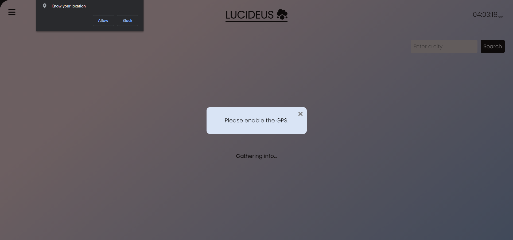
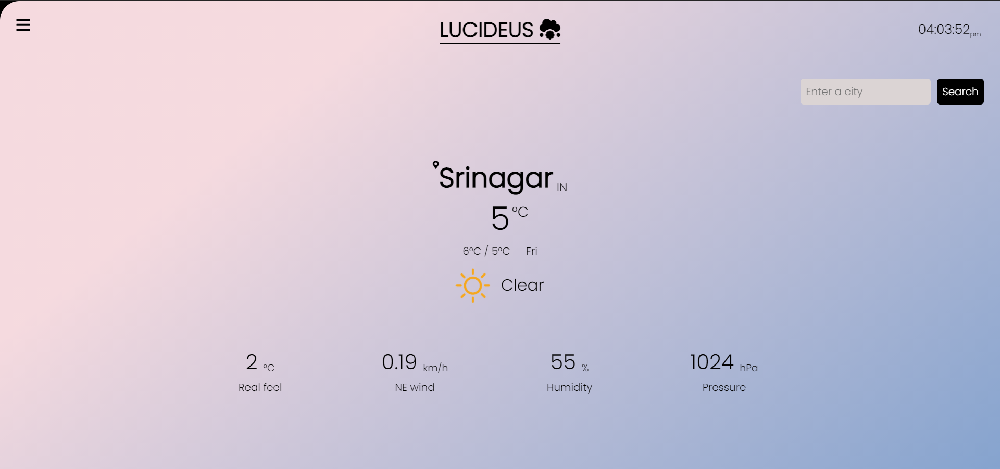
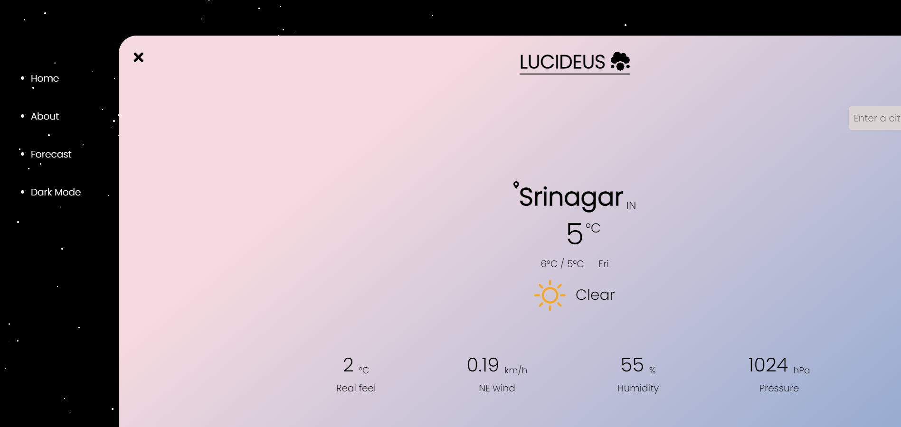
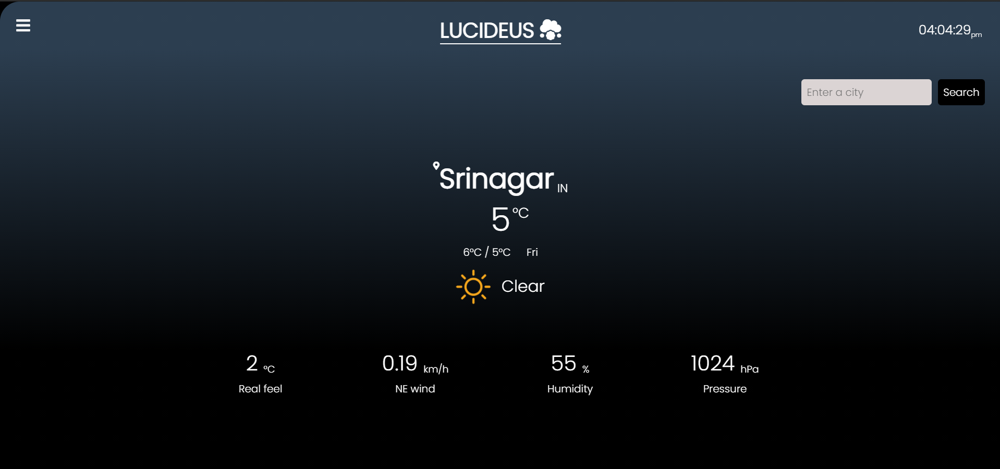
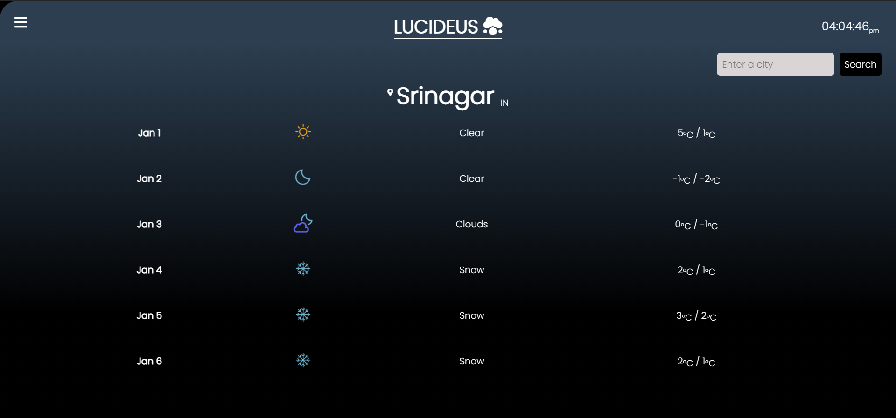
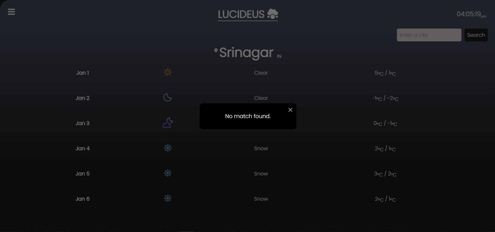

Tech Stack used:

- HTML CSS
- jQuery
- Fetch API
- Bootstrap
- Anime JS

API used - https://openweathermap.org/   
Website - https://lucideusweather.netlify.app/

     &ensp;
     &ensp;
     &ensp;
     &ensp;
     &ensp;
     &ensp;

